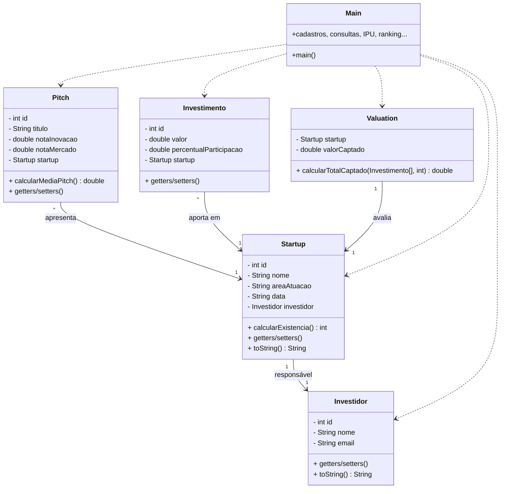

<div align="center">

# 🦈 Shark Hub

### Plataforma de Gestão de Investidores & Startups

*Trabalho Final — Fundamentos de Programação (4611C-6) · PUCRS*


</div>

---

## 📑 Sumário

- [Sobre o projeto](#-sobre-o-projeto)
- [Funcionalidades](#-funcionalidades)
- [Funcionalidade Inovadora — IPU](#-funcionalidade-inovadora--ipu-índice-de-potencial-de-unicornização)
- [Arquitetura e classes](#️-arquitetura-e-classes)
- [Estrutura de arquivos](#-estrutura-de-arquivos)
- [Como executar](#️-como-executar)
- [Guia do menu](#-guia-do-menu)
- [Exemplo de execução](#-exemplo-de-execução)
- [Regras de negócio e validações](#-regras-de-negócio-e-validações)
- [Conceitos de programação aplicados](#-conceitos-de-programação-aplicados)
- [Decisões de projeto](#-decisões-de-projeto)
- [Autores](#-autores)
- [Fontes utilizadas](#-fontes-utilizadas)
- [Lições aprendidas](#-lições-aprendidas)
- [Dificuldades encontradas e como superamos](#-dificuldades-encontradas-e-como-superamos)
- [Uso de IA](#-uso-de-ia)
- [Licença](#-licença)

---

## 🚀 Sobre o projeto

O **Shark Hub** é uma aplicação de console, escrita em **Java**, que simula o
universo do *venture capital*: investidores aportam capital em startups, que por
sua vez apresentam **pitches** e captam **investimentos**. A partir desses dados,
o sistema calcula automaticamente métricas de mercado — *valuation*, ranking e o
nosso **Índice de Potencial de Unicornização (IPU)**.

O projeto foi construído inteiramente com os conceitos vistos na disciplina de
Fundamentos de Programação: **classes, encapsulamento, vetores de objetos,
seleção, repetição, modularização e manipulação de Strings**.

> 💡 Toda a informação do sistema é armazenada em **vetores de objetos** — são
> quatro vetores no `Main`: investidores, startups, pitches e investimentos.

---

## ✨ Funcionalidades

| # | Funcionalidade | Descrição |
|---|----------------|-----------|
| 1 | Cadastrar Investidor | Cadastro com **validação de e-mail único** |
| 2 | Cadastrar Startup | Vinculada a um investidor responsável |
| 3 | Adicionar Pitch | Notas de inovação e mercado (0 a 10) |
| 4 | Adicionar Investimento | Valor e percentual de participação |
| 5 | Consultar Startup | **Dossiê completo**: dados + pitches + investimentos + total captado |
| 6 | Consultar Investidores | Lista todos os investidores |
| 7 | Consultar Investimentos | Lista todos os investimentos |
| 8 | Calcular Valuation | Total captado por uma startup |
| 9 | Ranking de Startups | Ordenado pelo IPU (bubble sort) |
| 10 | **Índice de Unicornização (IPU)** | ⭐ Funcionalidade inovadora |
| 11 | Listar Pitches | Lista todos os pitches e suas médias |
| 12 | Simulador de Crescimento | 🚀 Desafio extra: projeção de 5 anos |

✅ Todas as funcionalidades estão implementadas e testadas.

---

## ⭐ Funcionalidade Inovadora — IPU (Índice de Potencial de Unicornização)

O **IPU** é a "alma" do Shark Hub: uma pontuação que o sistema calcula sozinho
para cada startup, combinando os três fatores que mais pesam para uma startup
virar um **unicórnio** (avaliação > US$ 1 bi):

```
IPU = (média das notas dos pitches) × 25
    + (total captado em investimentos) ÷ 10000
    + (tempo de existência em anos)    × 10
```

### 🧠 Por que essa fórmula?

| Fator | Peso | Justificativa |
|-------|------|---------------|
| Média dos pitches | × 25 | Mede a **qualidade percebida** (inovação + mercado). Como a nota vai de 0 a 10, o peso 25 leva a faixa para 0–250. |
| Total captado | ÷ 10000 | Mede a **confiança do mercado** em dinheiro real. Dividimos por 10 mil para grandes aportes não "esmagarem" os outros fatores. |
| Tempo de existência | × 10 | Mede **maturidade/sobrevivência** — startups que duram acumulam pontos. |

### 🏷️ Classificação automática

| Pontuação (IPU) | Classificação |
|-----------------|---------------|
| até 100 | 🌱 Startup Inicial |
| 101 a 250 | 📈 Startup Promissora |
| 251 a 500 | 🚀 Startup em Crescimento |
| acima de 500 | 🦄 Potencial Unicórnio |

A **opção 10** ainda exibe os indicadores que o trabalho exige:

- 🥇 Startup **mais promissora** (maior IPU)
- 💰 Startup com **maior volume de investimentos**
- 👤 **Investidor** com maior valor investido
- 📊 **Ranking** completo das startups
- 🏷️ **Classificação** individual de cada startup

> **Exemplo real do sistema:** uma startup com média de pitches `8.5`, total
> captado `R$ 500.000` e `6` anos de existência resulta em
> `8.5 × 25 + 500000 ÷ 10000 + 6 × 10 = 212.5 + 50 + 60 = 322.5` → **Startup em Crescimento** 🚀

---

## 🏗️ Arquitetura e classes

O sistema usa relacionamentos entre objetos (composição/associação):



**Leitura rápida:** uma `Startup` tem **um** `Investidor` responsável; um `Pitch`
e um `Investimento` pertencem a **uma** `Startup`; a `Valuation` calcula o total
captado por uma startup específica.

---

## 📁 Estrutura de arquivos

```
trabalho-final/
├── Main.java          # Menu, fluxo do programa e regras de negócio (IPU, ranking, valuation)
├── Investidor.java    # Quem investe
├── Startup.java       # A empresa (calcula seu tempo de existência a partir da data)
├── Pitch.java         # Apresentação da startup (calcula a média das notas)
├── Investimento.java  # Aporte de capital em uma startup
├── Valuation.java     # Calcula o total captado por uma startup
└── README.md          # Este arquivo
```

---

## ▶️ Como executar

**Pré-requisito:** Java JDK 8 ou superior instalado (`java -version`).

```bash
# 1. Clonar o repositório
git clone https://github.com/Trabalho-Final-SharkHub/trabalho-final.git
cd trabalho-final

# 2. Compilar todos os arquivos
javac *.java

# 3. Executar
java Main
```

---

## 🎮 Guia do menu

```
=========== Shark Hub ============
0) SAIR
1) Cadastrar Investidor
2) Cadastrar Startup
3) Adicionar Pitch
4) Adicionar Investimento
5) Consultar Startup
6) Consultar Investidores
7) Consultar Investimentos
8) Calcular Valuation
9) Exibir Ranking de Startups
10) Exibir Indice de Unicornizacao (IPU)
---------- Cases Extras ----------
11) Listar Pitches
12) Simulador de Crescimento (5 anos)
==================================
```

**Ordem sugerida de uso:** cadastre **investidores** (1) → cadastre **startups**
(2) → adicione **pitches** (3) e **investimentos** (4) → explore as métricas
(5, 8, 9, 10). O programa só encerra na opção **0**.

---

## 📺 Exemplo de execução

```
Digite o ID do investidor: 10
Digite o nome do investidor: Ana Silva
Digite o email do investidor: ana@email.com
Investidor cadastrado com sucesso!

===== Dossie da Startup =====
ID: 100
Nome: TechAI
Area de Atuacao: Inteligencia Artificial
Data de fundacao: 10/03/2020
Tempo de existencia: 6 ano(s)
Investidor responsavel: Ana Silva

--- Pitches ---
- Pitch IA | Media: 8.5

--- Investimentos ---
- R$ 500000.0 (20.0%)

Total captado: R$ 500000.0
=============================

--- Indice de Potencial de Unicornizacao (IPU) ---
Startup mais promissora: TechAI (IPU: 322.5)
Startup com maior volume de investimentos: TechAI (Total captado: R$ 500000.0)
Investidor com maior valor investido: Ana Silva (Total: R$ 500000.0)
TechAI | IPU: 322.5 | Classificacao: Startup em Crescimento
```

---

## 🛡️ Regras de negócio e validações

- ✅ **E-mail único:** dois investidores não podem ter o mesmo e-mail.
- ✅ **Startup exige investidor:** não dá para cadastrar startup sem ao menos um investidor.
- ✅ **Notas dos pitches** devem estar entre **0 e 10**.
- ✅ **Valor do investimento** deve ser **maior que zero**.
- ✅ **Percentual de participação** deve estar entre **0 e 100**.
- ✅ **Buscas por ID** evitam associar pitch/investimento à startup errada.
- ✅ **Listas vazias e IDs inexistentes** são tratados sem quebrar o programa.

---

## 🎓 Conceitos de programação aplicados

Mapeamento direto com o conteúdo da disciplina:

| Conceito | Onde aparece no código |
|----------|------------------------|
| **Variáveis e operadores** | Cálculo do IPU, valuation, simulador de crescimento |
| **Entrada de dados e *casting*** | `lerInteiro` / `lerDouble` (tratam o buffer do `Scanner`) |
| **Seleção (if / switch)** | Menu principal, validações, `classificarIPU` |
| **Repetição (for / while / do-while)** | Percorrer vetores, menu, validação de e-mail |
| **Modularização (métodos com retorno)** | `buscarStartupPorId`, `calcularIPU`, `emailJaExiste`... |
| **Classe String e métodos** | `equals`, `substring`, `charAt` (extração do ano) |
| **Orientação a Objetos** | 6 classes com construtor, getters/setters e `toString` |
| **Vetores (arrays)** | 4 vetores de objetos + vetores auxiliares no ranking |
| **Array de objetos** | `investidores[]`, `startups[]`, `pitches[]`, `investimentos[]` |
| **Algoritmo de ordenação** | *Bubble sort* no ranking de startups |

---

## 🧩 Decisões de projeto

- **Tempo de existência sem bibliotecas de data:** a `data` é uma `String`
  (`"dd/mm/aaaa"`). Extraímos os 4 últimos caracteres com `substring` e
  convertemos o ano **dígito por dígito** com `charAt`, sem usar `split`,
  `parseInt` ou `java.time` — tudo dentro do conteúdo da disciplina.
- **Total captado na classe `Valuation`:** centralizamos a soma dos
  investimentos de uma startup em `Valuation.calcularTotalCaptado`, mantendo a
  responsabilidade num lugar só.
- **Comparação por ID:** ao filtrar pitches/investimentos de uma startup,
  comparamos pelo **ID** (`getId()`), que é mais seguro do que comparar objetos.
- **Leitura robusta do teclado:** `lerInteiro`/`lerDouble` sempre consomem o
  `"Enter"` que sobra no buffer, evitando o clássico bug de campos vindo vazios.

---

## 👥 Autores

| Nome | Matrícula |
|------|-----------|
| **Otavio Machado** | 26108750 |
| **Lorenzo Debiasi** | 26103916 |

---

## 📚 Fontes utilizadas

- Materiais, slides e exercícios da disciplina **Fundamentos de Programação (PUCRS)**.
- Documentação oficial do Java (Oracle): <https://docs.oracle.com/javase/>
- Anotações de aula sobre vetores de objetos, encapsulamento, Strings e estruturas de repetição.

---

## 🎯 Lições aprendidas

- Como **modelar um problema real** com classes e relacionamentos entre objetos.
- A importância do **encapsulamento** (atributos privados + getters/setters).
- O padrão de **percorrer um vetor de objetos filtrando** os que pertencem a uma
  entidade — usado em praticamente todas as consultas e no IPU.
- Como implementar uma **ordenação simples** (bubble sort) e entendê-la de verdade.
- Como **dividir um problema grande** (o IPU) em métodos menores e testáveis.

---

## 🧗 Dificuldades encontradas e como superamos

| Dificuldade | Solução |
|-------------|---------|
| **Bug do `Scanner`** — o `"Enter"` ficava no buffer após `nextInt()`/`nextDouble()`, fazendo o título do pitch vir vazio | Criamos `lerInteiro`/`lerDouble`, que leem o número e em seguida fazem `nextLine()` para limpar o buffer |
| **Validação de e-mail** — a verificação retornava cedo demais, checando só o primeiro investidor | Criamos `emailJaExiste`, que percorre **todos** os investidores antes de decidir, usando `.equals()` |
| **Pitch/investimento na startup errada** — o código usava o ID como índice do vetor | Criamos `buscarStartupPorId`, que encontra a startup correta pelo ID |
| **Erros de compilação** — código duplicado fora da classe em `Pitch.java` e `}` a mais em `Valuation.java` | Removemos o código duplicado e a chave extra |
| **Calcular o ano sem bibliotecas** | Extração com `substring` + conversão `charAt` dígito por dígito |

---

## 🤖 Uso de IA

- **Ferramenta utilizada:** Claude Code (assistente de programação baseado em IA).
- **Objetivo do uso:** entender o que faltava no projeto, identificar os bugs
  existentes e nos orientar sobre a lógica de cada funcionalidade. A IA atuou
  como um **guia** — o código foi escrito, revisado e testado por nós, sempre
  respeitando os limites do conteúdo da disciplina (sem `try/catch`, sem operador
  ternário, sem `String.format`, sem bibliotecas de data).
- **Principais prompts utilizados:**
  - *"Veja o GitHub, atualize o projeto e termine o trabalho."*
  - *"Quais bugs existem no código atual e como corrigi-los?"*
  - *"Como implementar o cálculo do IPU e o ranking de startups?"*
  - *"Não podemos usar `try`, `split`, `parseInt`, operador ternário nem `String.format` — ajuste o código."*
- **Principais respostas obtidas:**
  - Explicação do bug do `Scanner` e a solução com leitura via `nextLine()`.
  - Orientação para criar métodos de busca por ID e reutilizá-los nas opções do menu.
  - Sugestão de fórmula para o IPU combinando média dos pitches, total captado e tempo de existência.
  - Reescrita de trechos para ficarem **100% dentro do conteúdo de aula**.
- **Reflexão:** a IA acelerou a identificação dos problemas e nos ajudou a
  organizar o raciocínio. Aprendemos, na prática, o motivo do bug do buffer do
  `Scanner` e a importância de reutilizar métodos em vez de repetir código.
  Também percebemos o valor de **delimitar as ferramentas permitidas** — pedir à
  IA para reescrever usando só o que vimos em aula reforçou nosso aprendizado.
  Numa próxima vez, escreveríamos os testes manuais (listas vazias, IDs
  inexistentes, e-mail repetido) **antes** de implementar, para validar cada
  parte mais cedo.

---

## 📄 Licença

Projeto acadêmico desenvolvido para fins educacionais — disciplina de
Fundamentos de Programação, PUCRS.

<div align="center">

**🦈 Shark Hub** — *"Que comece o feeding frenzy dos investimentos."*

</div>
